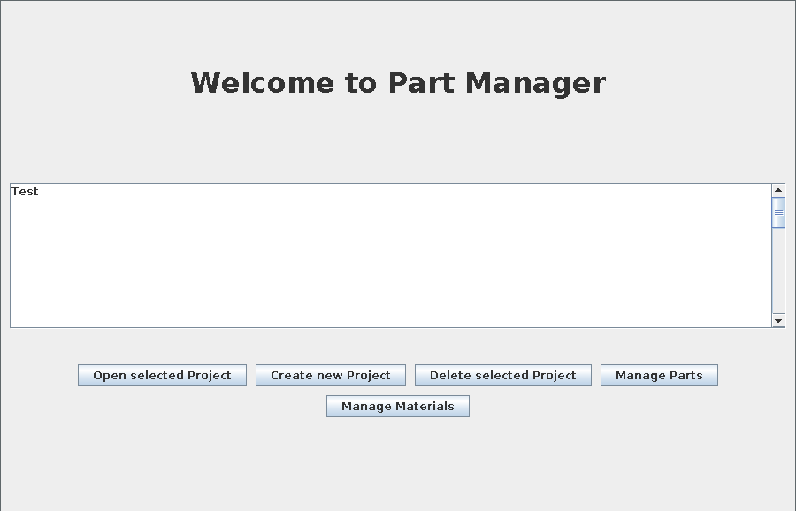
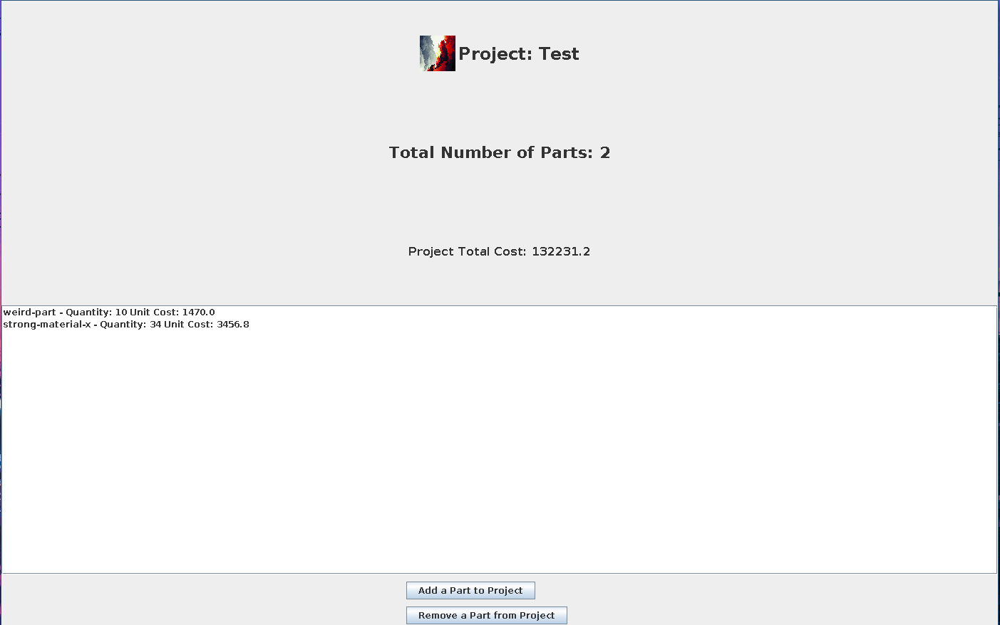

# Part-Manager
A simple parts & materials management app written in Java with Swing API.

For more check the output folder...

### Project Structure

## Folder Structure

The workspace contains two folders by default, where:

- `src`: the folder to maintain sources
- `lib`: the folder to maintain dependencies
